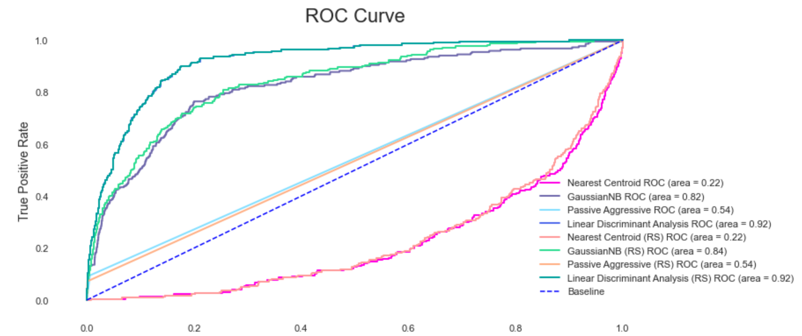
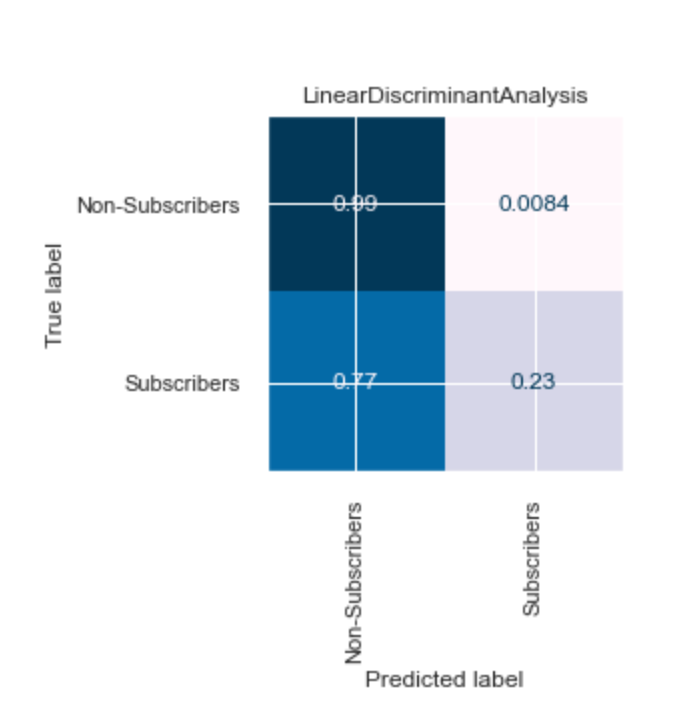
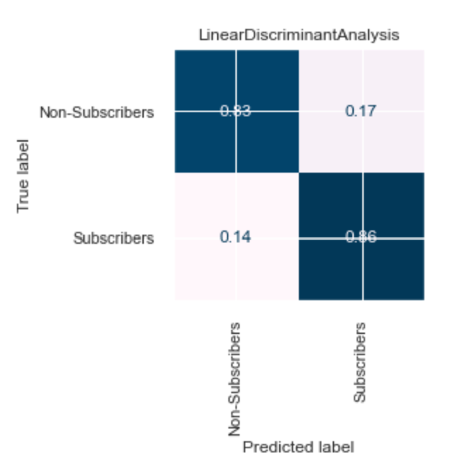
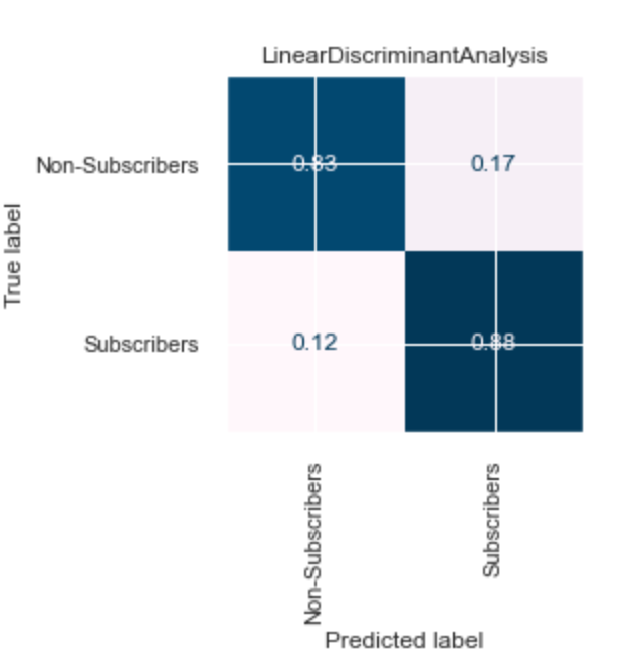
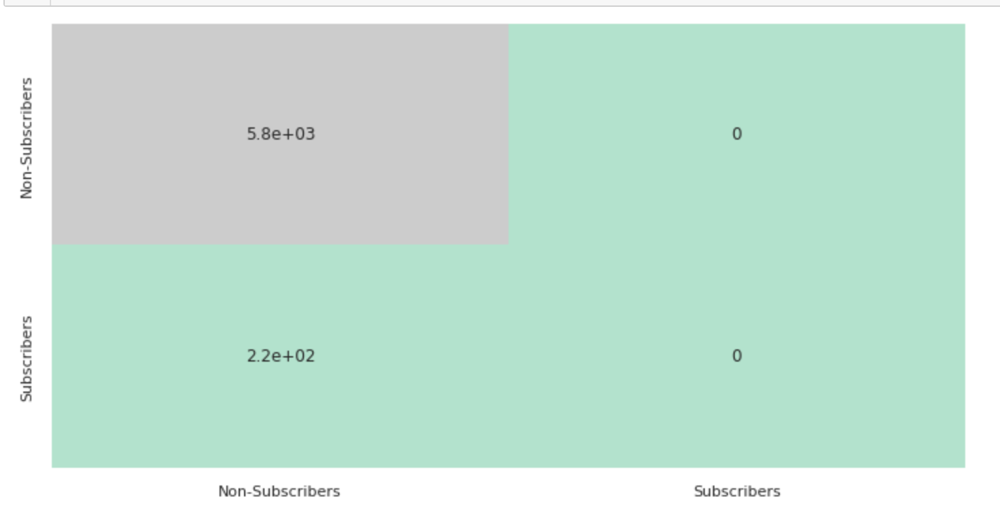
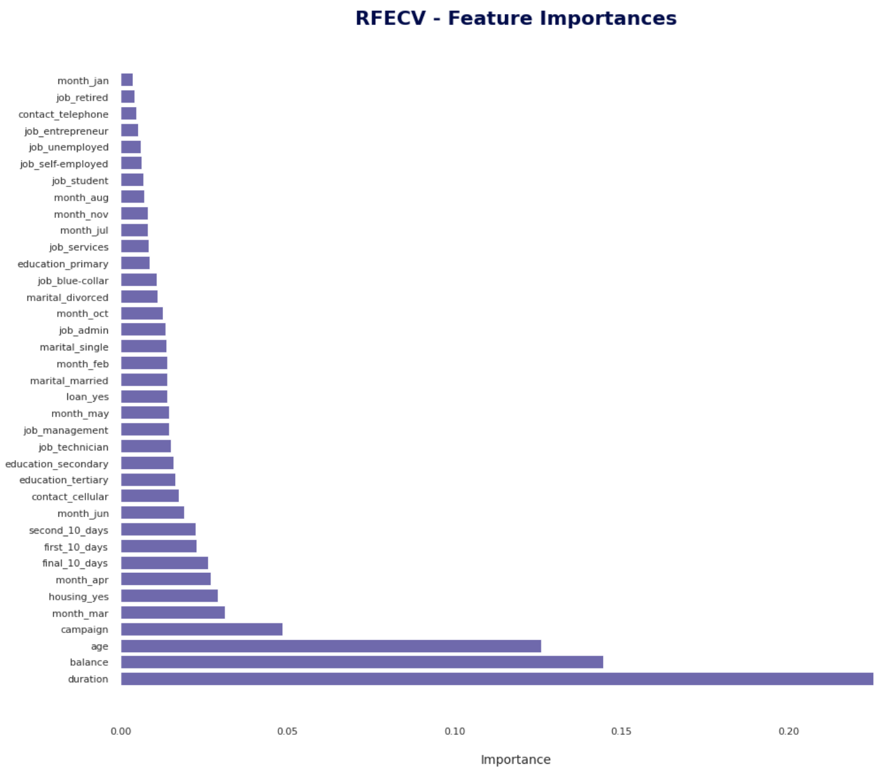

 

<h1 align="center">
   
Deposit Marketing
</h1>

    

## Background:

We are a small startup focusing mainly on providing machine learning solutions in the European banking market. We work on a variety of problems including fraud detection, sentiment classification and customer intention prediction and classification.

We are interested in developing a robust machine learning system that leverages information coming from call center data.
Ultimately, we are looking for ways to improve the success rate for calls made to customers for any product that our clients offer. Towards this goal we are working on designing an ever evolving machine learning product that offers high success outcomes while offering interpretability for our clients to make informed decisions.
  

## Data Description:

The data comes from direct marketing efforts of a European banking institution. The marketing campaign involves making a phone call to a customer, often multiple times to ensure a product subscription, in this case a term deposit. Term deposits are usually short-term deposits with maturities ranging from one month to a few years. The customer must understand when buying a term deposit that they can withdraw their funds only after the term ends. All customer information that might reveal personal information is removed due to privacy concerns.

  

## Attributes:

| Column     | Description     | Type   | 
|------------|-----------------| ------ | 
| `age`      | age of customer. | `numeric` | 
| `job`      | type of job. | `categorical` | 
| `marital`  | marital status. | `categorical` | 
| `education`  | education. | `categorical` |
| `default`  | has credit in default. | `binary` | 
| `balance`  | average yearly balance, in euros. | `numeric` | 
| `housing`  | has a housing loan?. | `binary` | 
| `loan`     | has personal loan? . | `binary` | 
| `contact`  | contact communication type. | `categorical` | 
| `day`      | last contact day of the month. | `numeric` | 
| `month`    | last contact month of year. | `categorical` | 
| `duration` | last contact duration, in seconds. | `numeric` | 
| `campaign` | number of contacts performed during this campaign and for this client. | `numeric` | 
| `y`        | has the client subscribed to a term deposit?. | `binary` | 

  

## Project Overview:

From the analysing, the bias toward the `no` class is clear, the following image shows **~90%** of the data points belong to the no or `not subscribers` class.

[//]: # (![cgapp_create]&#40;img/img1.png&#41;)
<h1 align="center"> </h1>

### **For ML, the plane was:**

1. Use the `Lazy Prediction` library to experiment with baseline models and see the top **4** models. After that, I tried to improve their scores through:

    1.1 `Randomized Search`.
    
    1.2  `Undersampling technique`.
    
    1.3 `Oversampling technique`.
        

2. Use `NLP` model.
3. Use `Recursive Feature Elimination`, to see the importance of the features.

### **ML result:**

1. `Baseline models:`

    The top **4** baseline models are:

   - Nearest Centroid Model
   - Passive Aggressive Classifier Model
   - GaussianNB Model
   - Linear Discriminant Analysis Model
     
   
    1.1. `Randomized Search`:
     - All of the models get slightly better with **randomized search hyperparameters** result, which is about **~1%** except the `Passive Aggressive Classifier` model score, it's dropped by **1%**.

     - The `Linear Discriminant Analysis` model has the highest score among of the models with and without the randomized search result, which is **92%**, but the bad news is, this high score came from the nearly ideal identifier for the majority class **(not subscribers)** and really bad classification for the minority class **(subscribers)**.

<h1 align="center"> </h1>
<h1 align="center"> </h1>

  
    1.2. `Undersampling Technique`:

Again, the `Linear Discriminant Analysis` model has the highest score which is `92%` but there is a huge difference in the confusion matrix. The model can classify the minority class by `88%` correct classification instead of `23%` in the previous one.
<h1 align="center"> </h1>

  

  
    1.3. `Oversampling Technique`:

It looks like we have nearly the same result with over or under-sampling techniques. The score is high as well as the confusion matrix looks good.
<h1 align="center"> </h1>

  

2. `NLP`:

By using the TensorBoard from TensorFlow, different values have been tested, the test score is `94%`, but the bad news is this model never identify the subscribers class as it's shown in the next image.

The test score is `94%`, but the bad news is this model never identify the subscribers class as it's shown in the next image.
<h1 align="center"> </h1>

3. `Recursive Feature Elimination`:

I used the **RandomForestClassifier** model and the result of the importance of the features are shown in the next image.
<h1 align="center"> </h1>

