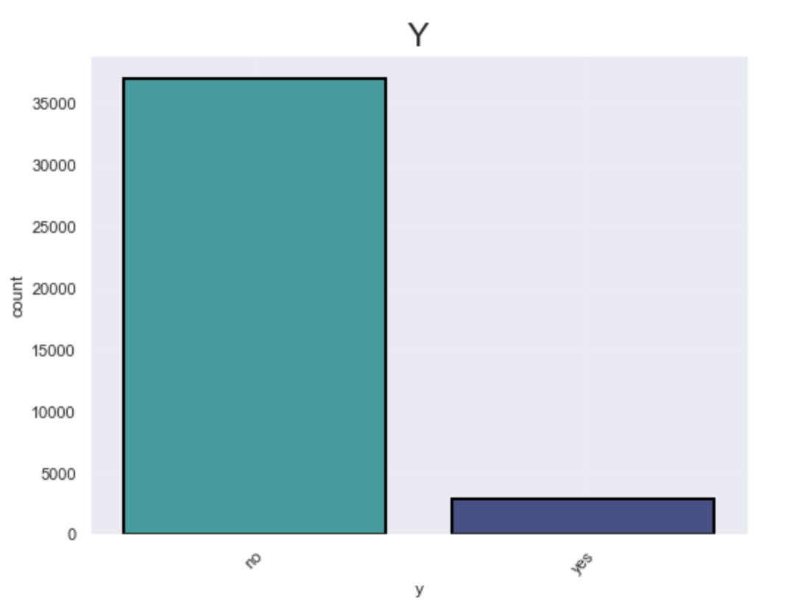

  

<h1 style = "font-size:10vw; text-align: center;"> Term Deposit Marketing </h1>

  

## Background:

We are a small startup focusing mainly on providing machine learning solutions in the European banking market. We work on a variety of problems including fraud detection, sentiment classification and customer intention prediction and classification.

We are interested in developing a robust machine learning system that leverages information coming from call center data.

Ultimately, we are looking for ways to improve the success rate for calls made to customers for any product that our clients offer. Towards this goal we are working on designing an ever evolving machine learning product that offers high success outcomes while offering interpretability for our clients to make informed decisions.

## Data Description:

The data comes from direct marketing efforts of a European banking institution. The marketing campaign involves making a phone call to a customer, often multiple times to ensure a product subscription, in this case a term deposit. Term deposits are usually short-term deposits with maturities ranging from one month to a few years. The customer must understand when buying a term deposit that they can withdraw their funds only after the term ends. All customer information that might reveal personal information is removed due to privacy concerns.

## Attributes:
<table >
  <tr>
    <th style = 'text-align: center'>Column</th>
    <th style = 'text-align: center'>Meaning</th>
  </tr>
  <tr>
    <td style = 'text-align: center'>age</td>
    <td style = 'text-align: left'>age of customer (numeric)</td>
  </tr>
  <tr>
    <td style = 'text-align: center'>job</td>
    <td style = 'text-align: left'>type of job (categorical)</td>
  </tr>
  <tr>
    <td style = 'text-align: center'>marital </td>
    <td style = 'text-align: left'>marital status (categorical)</td>
  </tr>
  <tr>
    <td style = 'text-align: center'>education </td>
    <td style = 'text-align: left'>education (categorical)</td>
  </tr>
  <tr>
    <td style = 'text-align: center'>default</td>
    <td style = 'text-align: left'>has credit in default? (binary)</td>
  </tr>
  <tr>
    <td style = 'text-align: center'>balance</td>
    <td style = 'text-align: left'>average yearly balance, in euros (numeric)</td>
  </tr>
    <tr>
        <td style = 'text-align: center'>housing</td>
        <td style = 'text-align: left'>has a housing loan? (binary)</td>
      </tr>
<tr>
        <td style = 'text-align: center'>loan</td>
        <td style = 'text-align: left'>has personal loan? (binary)</td>
      </tr>
<tr>
        <td style = 'text-align: center'>contact</td>
        <td style = 'text-align: left'> contact communication type (categorical)</td>
      </tr>
<tr>
        <td style = 'text-align: center'>day</td>
        <td style = 'text-align: left'>last contact day of the month (numeric)</td>
      </tr>
<tr>
        <td style = 'text-align: center'>month</td>
        <td style = 'text-align: left'> last contact month of year (categorical)</td>
      </tr>
<tr>
        <td style = 'text-align: center'>duration</td>
        <td style = 'text-align: left'>last contact duration, in seconds (numeric)</td>
      </tr>
<tr>
        <td style = 'text-align: center'>campaign</td>
        <td style = 'text-align: left'>number of contacts performed during this campaign and for this client (numeric, includes last contact)
</td>
      </tr>
<tr>
        <td style = 'text-align: center'>y</td>
        <td style = 'text-align: left'>has the client subscribed to a term deposit? (binary)**desired target**</td>
      </tr>
</table>

# Goal(s):

Predict if the customer will subscribe (yes/no) to a term deposit (variable y)

## Project Overview
As you can see, we have a high bias data toward the `no` or `non-subscribers` class, as a result, multiple technics have been applied to improve the score like **random search**, **oversampling**, **undersampling**, **MLP**, and finally **Recursive Feature Elimination**.
  

[//]: # (

)

- The chosen score is: `ROC AUC` score due to the importance of capturing and getting the `subscribers` or the `yes` class.

- The data has been analysed and there are no clear lines between both the classes. On the other hand, the model was able to achieve `86%` of accuracy. Moreover, the classification error rate for the nonsubscribers is `17%`, while it's lower in the subscribers class which is `11%`.

- To achieve this score many models and technics are tested, some return a high score like oversampling technic and some I believe needs more time like the MLP and test other hyperparameters may return a better score. Anyway, our best model, for now, is the `Linear Discriminant Analysis`.

**OrFuUuD3rXXP8tUk**
